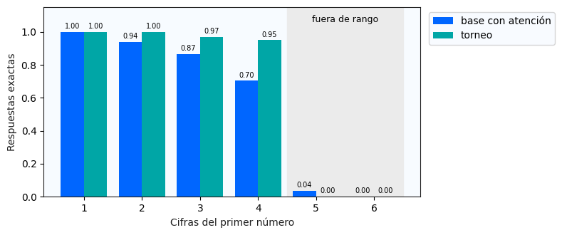
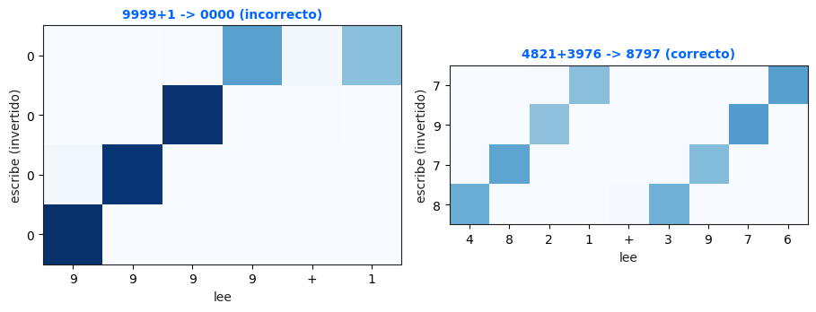

<div align="center">

<h1>Calculadora Neuronal</h1>

<p><strong>Laboratorio 6 · Deep Learning · Sección 30</strong></p>

<p>
  
  
  
  
  
</p>

<p><em>¿Puede una red recurrente aprender a sumar y restar observando únicamente ejemplos?</em></p>

</div>

---

## Resumen

Este repositorio documenta una calculadora neuronal `seq2seq` que recibe expresiones como
`4821+3976` y genera el resultado carácter por carácter. El sistema combina una GRU bidireccional en el
encoder, atención aditiva de Bahdanau y un decoder recurrente. El experimento compara un contexto fijo,
atención dinámica y una variante de torneo que invierte únicamente el orden de la salida.

> **Resultado principal.** Invertir la salida elevó la exactitud de validación de **83.70 %** a
> **97.20 %** y la exactitud en operandos de cuatro cifras de **70.33 %** a **95.00 %**, sin aumentar
> los **186,767 parámetros** del modelo.

El notebook oficial quedó ejecutado en orden hasta el torneo. Con la clave `5978`, la calculadora obtuvo
**80.5/100** y el formulario confirmó el envío. El checkpoint se cargó sin reentrenar y la huella se
mantuvo en `94e198ec75ec` antes y después de la inferencia.

## Identificación

| Campo | Valor |
|---|---|
| Estudiante | Pablo Daniel Barillas Moreno |
| Carné | 22193 |
| Curso | Deep Learning 2026 |
| Sección | 30 |
| Modalidad | Individual |
| Repositorio | [GitHub](https://github.com/DanielBarillasM/Laboratorio-6_Daniel-Barillas_22193_DLYSI_Sec-30) |

## Resultado oficial del torneo · Laboratorio 7

| Nivel | Aciertos | Puntaje |
|---|---:|---:|
| 1 · Calentamiento | 20/20 | **15.0/15** |
| 2 · Cuatro cifras | 17/20 | **25.5/30** |
| 3 · Acarreos en cadena | 16/16 | **40.0/40** |
| 4 · Jefe final | 0/10 | **0.0/15** |
| **Total** | **53/66** | **80.5/100** |

El resultado confirma la lectura experimental previa: el orden de salida invertido resolvió todos los
acarreos encadenados de la prueba, pero no extrapoló a operandos de cinco cifras. Las respuestas completas,
los problemas y la trazabilidad del envío están en
[`artifacts/metricas/torneo_5978.json`](artifacts/metricas/torneo_5978.json).

## Resultados reproducidos

| Modelo | Atención | Salida invertida | Validación | Parámetros | Huella |
|---|:---:|:---:|---:|---:|---|
| Baseline con atención | Sí | No | **83.70 %** | 186,767 | `7dd56f9acf5d` |
| Baseline sin atención | No | No | **67.25 %** | 186,767 | `11a6346d696d` |
| Torneo | Sí | Sí | **97.20 %** | 186,767 | `94e198ec75ec` |

### Exactitud por cantidad de cifras

| Cifras | Con atención | Sin atención | Torneo |
|---:|---:|---:|---:|
| 1 | 100.00 % | 100.00 % | 100.00 % |
| 2 | 94.00 % | 96.67 % | 100.00 % |
| 3 | 86.67 % | 74.33 % | 97.00 % |
| 4 | 70.33 % | 50.00 % | 95.00 % |
| 5 · fuera de rango | 3.67 % | 0.00 % | 0.00 % |
| 6 · fuera de rango | 0.00 % | 0.00 % | 0.00 % |



La mejora dentro del rango de entrenamiento no implica que la red haya descubierto un algoritmo
universal. La caída a cero en cinco y seis cifras evidencia que la generalización fuera de distribución
sigue siendo limitada.

## Cinco contraejemplos válidos

| Problema | Predicción | Correcta | Debilidad observada |
|---|---:|---:|---|
| `9999+1` | `0000` | `10000` | Acarreo a través de todas las columnas y cambio de longitud |
| `9998+2` | `0000` | `10000` | Acarreo encadenado desde unidades |
| `9999+9999` | `18998` | `19998` | Acarreos simultáneos en cuatro posiciones |
| `1000-999` | `11` | `1` | Préstamo encadenado y resultado corto |
| `4000-3999` | `001` | `1` | Préstamos a través de ceros y ceros iniciales espurios |



Estos fallos sustentan la conclusión del laboratorio: el modelo aprende una aproximación estadística muy
efectiva dentro de la distribución, pero no una implementación simbólica infalible de la aritmética.

## Arquitectura

```text
expresión de entrada
        │
        ▼
embedding + GRU bidireccional
        │  h₁ … hₜ
        ▼
atención aditiva de Bahdanau ◄── estado actual del decoder
        │  contexto dinámico
        ▼
GRUCell + proyección a vocabulario
        │
        ▼
respuesta carácter por carácter
```

La atención calcula

\[
e_j=v^\top\tanh(W_qs+W_kh_j),\qquad
\alpha=\operatorname{softmax}(e),\qquad
c=\sum_j\alpha_jh_j.
\]

Los `<PAD>` se enmascaran con `-∞` antes del `softmax`, por lo que reciben peso exactamente cero.

## Organización del repositorio

```text
.
├── notebooks/
│   ├── 00_machote_original.ipynb
│   └── 01_calculadora_neuronal_final.ipynb
├── modelos_lab6/
│   ├── base_con_atencion.pt
│   ├── base_sin_atencion.pt
│   └── torneo_22193.pt
├── tareas/
│   ├── task_00_investigacion/
│   ├── task_01_generador/
│   ├── task_02_atencion_bahdanau/
│   ├── task_03_decoder/
│   ├── task_04_entrenamiento/
│   ├── task_05_evaluacion_atencion/
│   ├── task_06_modelo_torneo/
│   └── task_07_casos_adversariales/
├── artifacts/
│   ├── figuras/
│   ├── mapas_atencion/
│   ├── metricas/
│   └── validacion/
├── informe/
├── presentacion_repositorio/
├── presentacion_html/
│   ├── index.html
│   └── assets/
├── scripts/
└── docs/
```

Cada carpeta `task_*` explica el objetivo, la implementación, la evidencia y el criterio de cumplimiento
del bloque homónimo de la rúbrica.

## Reproducción

### 1. Clonar e instalar

```bash
git clone https://github.com/DanielBarillasM/Laboratorio-6_Daniel-Barillas_22193_DLYSI_Sec-30.git
cd Laboratorio-6_Daniel-Barillas_22193_DLYSI_Sec-30
python -m pip install -r requirements.txt
```

### 2. Revisar el notebook ejecutado

Abra `S13_Lab06_Calculadora_Neuronal_ESTUDIANTE.ipynb`, la copia con el nombre oficial solicitado, o
`notebooks/01_calculadora_neuronal_final.ipynb`. Los modelos guardados se cargan automáticamente,
por lo que no vuelven a entrenarse mientras los archivos `.pt` y sus configuraciones no cambien.

```bash
jupyter lab notebooks/01_calculadora_neuronal_final.ipynb
```

### 3. Reconstrucción controlada

```bash
python scripts/build_notebook.py
python scripts/execute_notebook.py --stage discover
python scripts/build_notebook.py
python scripts/execute_notebook.py --stage final
python scripts/exportar_figuras.py
python scripts/verificar_entrega.py
```

`build_notebook.py` parte siempre del machote preservado, comprueba que las verificaciones oficiales de
los bloques 2 y 3 no cambien y rellena las conclusiones con `artifacts/metricas/resultados.json`.

## Presentación HTML interactiva

La carpeta [`presentacion_html/`](presentacion_html/) contiene una presentación autónoma de 15 secciones
que recorre el reto, la investigación, la arquitectura, la implementación, el diseño experimental, los
resultados, los mapas de atención, los casos adversariales y el estado real de cumplimiento.

Para abrirla, ejecute desde la raíz del repositorio:

```powershell
Start-Process .\presentacion_html\index.html
```

También puede abrir [`presentacion_html/index.html`](presentacion_html/index.html) directamente en Chrome,
Edge o Firefox. No necesita servidor ni conexión a internet. Incluye:

- navegación por botones, índice lateral, teclado y gestos táctiles;
- modo de pantalla completa con la tecla `F`;
- guion de exposición con la tecla `G`;
- vista general con la tecla `O`;
- adaptación para teléfonos y pantallas pequeñas;
- estilos de impresión para exportarla a PDF desde el navegador;
- las siete figuras reales del notebook, sin duplicar archivos ni fabricar resultados.

La presentación refleja el cierre completo: registro inicial y torneo aceptados, puntaje `80.5/100` y
huella `94e198ec75ec` preservada sin reentrenamiento.

## Decisiones experimentales

- Semilla fija: `2026`.
- Entrenamiento: 40,000 ejemplos, 15 épocas, lote 128, `lr=3e-3`.
- Rango permitido: operandos de una a cuatro cifras.
- Evaluación por longitud: 300 ejemplos por cantidad de cifras.
- Experimento del torneo: cambia únicamente `invertir_salida=True`.
- Límite: 186,767 de 750,000 parámetros permitidos.
- Dispositivo: CPU, conforme a la guía.
- Dependencias del notebook: PyTorch, Matplotlib y biblioteca estándar; no utiliza NumPy ni
  `nn.MultiheadAttention`.

## Estado de la rúbrica

- [x] Investigación guiada con fuentes académicas.
- [x] Conteo del espacio de problemas y discusión de memorización.
- [x] Atención aditiva implementada y verificada.
- [x] Paso del decoder implementado y verificado.
- [x] Baselines con y sin atención entrenados.
- [x] Exactitud por cifras y mapas de atención interpretados.
- [x] Hipótesis controlada y modelo del torneo bajo el límite de parámetros.
- [x] Cinco problemas válidos que rompen la calculadora.
- [x] Notebook ejecutado sin errores hasta la celda de Entrega.
- [x] Pesos y huellas preservados.
- [x] Envío del formulario confirmado con el mensaje oficial y huella `94e198ec75ec`.
- [x] Clave `5978` ejecutada durante el torneo del Laboratorio 7.
- [x] Puntaje `80.5/100` registrado y huella verificada antes y después.

## Documentos

- [Informe académico en PDF](informe/informe_laboratorio_6.pdf)
- [Fuente LaTeX del informe](informe/informe_laboratorio_6.tex)
- [Presentación del repositorio en PDF](presentacion_repositorio/presentacion_repositorio.pdf)
- [Fuente LaTeX de la presentación](presentacion_repositorio/presentacion_repositorio.tex)
- [Presentación HTML interactiva](presentacion_html/index.html)
- [Guía de uso de la presentación HTML](presentacion_html/README.md)
- [Checklist de rúbrica](docs/CHECKLIST_RUBRICA.md)
- [Plan de trabajo](docs/PLAN_TRABAJO.md)
- [Referencias](docs/REFERENCIAS.md)

## Referencias

1. Bahdanau, D., Cho, K. y Bengio, Y. (2014). *Neural Machine Translation by Jointly Learning to Align
   and Translate*. [arXiv:1409.0473](https://arxiv.org/abs/1409.0473).
2. Sutskever, I., Vinyals, O. y Le, Q. V. (2014). *Sequence to Sequence Learning with Neural Networks*.
   [arXiv:1409.3215](https://arxiv.org/abs/1409.3215).
3. Kassis, T., Agarwal, V., He, Y., Patel, D. y Brueckner, A. M. (2026). *Scientific Agent Skills: A
   Library of Procedural Knowledge for Research Agents*.
   [arXiv:2609.00065](https://doi.org/10.48550/arXiv.2609.00065).

## Nota de integridad

La IA se utilizó como apoyo de ingeniería para estructuración, revisión, automatización y presentación.
Las afirmaciones académicas se fundamentan en las fuentes citadas; la IA no se presenta como fuente. Las
métricas, predicciones, huellas y figuras provienen de la ejecución reproducible incluida en el repositorio.

---

<div align="center">
<sub>Paleta Tech Innovation · Electric Blue #0066FF · Neon Cyan #00FFFF · Dark Gray #1E1E1E</sub>
</div>
